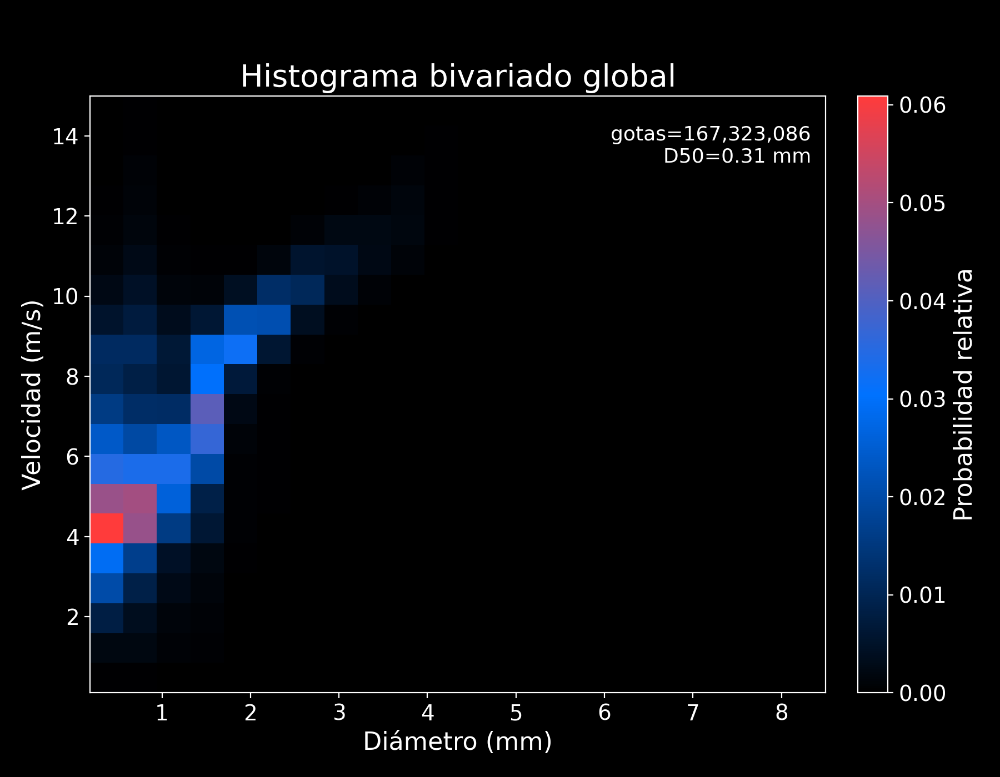
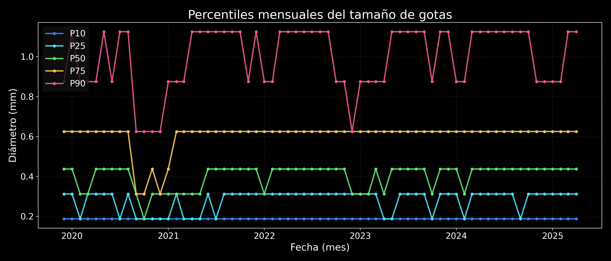
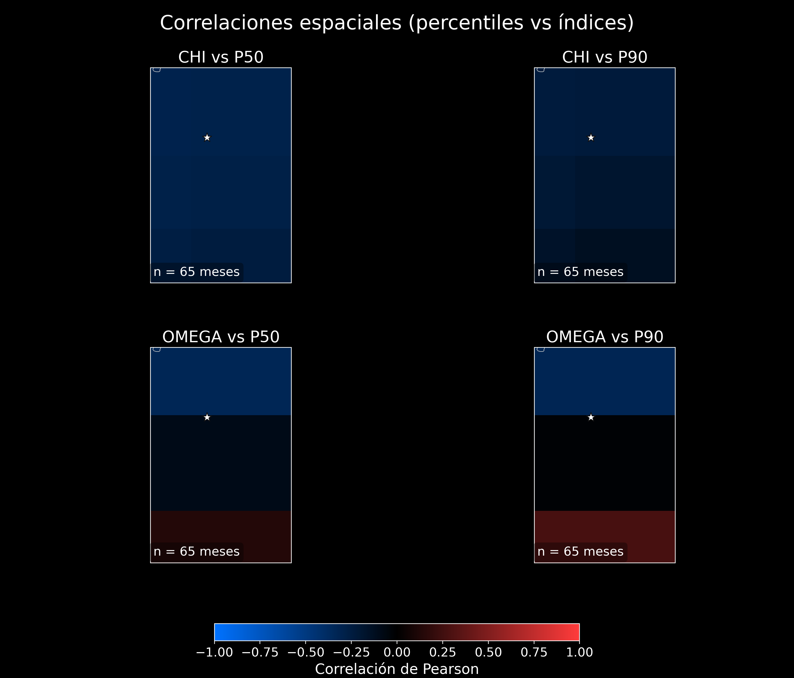

# Microfísica de precipitación con disdrómetro SIATA y reanálisis NOAA

### Análisis reproducible en Python · Santa Elena, Antioquia · 2019–2025


[](https://github.com/LindaCatalina/siata-disdrometer-rainfall-microphysics/actions/workflows/tests.yml)


Este proyecto caracteriza la distribución de tamaños y velocidades de caída de
las gotas registradas por el disdrómetro SIATA 417, ubicado en el radar de Santa
Elena, y evalúa su relación mensual con OMEGA y CHI del NCEP/NCAR Reanalysis 1.
El flujo procesa más de 5 GB de observaciones por bloques, aplica controles de
calidad, conserva trazabilidad de las fuentes y genera resultados numéricos y
gráficos auditables.

> **Resultado principal:** 167.323.086 partículas válidas en 344.579 minutos con
> precipitación efectiva y calidad superior a 80, entre diciembre de 2019 y
> abril de 2025.

## Resultados clave

| Indicador | Resultado |
|---|---:|
| Partículas espectrales válidas | 167.323.086 |
| Diámetro medio / mediano | 0,502 / 0,3125 mm |
| Velocidad media / mediana | 2,610 / 2,400 m/s |
| Meses comparables con NOAA | 65 |
| Relación espectro / contador interno | 99,31 % |
| Correlación CHI–P50 | -0,279 |
| Correlación OMEGA–P50 | -0,124 |

Los diámetros se concentran principalmente por debajo de 1 mm y el histograma
bivariado conserva la relación física positiva entre diámetro y velocidad de
caída. Las asociaciones mensuales entre los percentiles y los índices de gran
escala son débiles; se reportan como evidencia exploratoria, no como causalidad.







## Pregunta y objetivo

**Pregunta:** ¿cómo se distribuyen el tamaño y la velocidad de caída de las
gotas observadas en Santa Elena y cómo cambian sus percentiles mensuales frente
a OMEGA y CHI?

**Objetivo:** construir un flujo reproducible que integre observaciones de alta
frecuencia del disdrómetro con reanálisis atmosférico mensual, controle errores
de calidad y produzca resultados verificables con memoria moderada.

## Valor técnico demostrado

- Ingeniería de datos para siete CSV anuales y 440 clases espectrales.
- Procesamiento incremental de 5,28 GB sin cargar todo el histórico en memoria.
- Validación física del orden diámetro–velocidad del telegrama Thies LPM.
- Control explícito de conteos negativos y contraste con el contador `var16`.
- Integración de escalas temporal y espacial entre SIATA y NOAA.
- Visualización científica, pruebas automatizadas y manifiesto SHA-256.

## Datos y alcance espacial

Los datos crudos no se versionan en GitHub debido a su tamaño. El repositorio
conserva sus fuentes, metadatos y hashes; el script de descarga permite obtenerlos
de nuevo:

- [SIATA — histórico y metadatos de disdrómetros](https://siata.gov.co/usuarios/jsepulveda/disdrometro/)
- [NOAA PSL — NCEP/NCAR Reanalysis 1](https://psl.noaa.gov/data/gridded/data.ncep.reanalysis.html)

Configuración utilizada:

- estación `417 — Santa Elena Radar - Disdrometro` (`6.1935° N`, `-75.5276°`);
- cuadro: `2.3966–8.0147° N`, `76.9964–73.3244° O`;
- OMEGA mensual a `500 hPa` (`Pa/s`);
- CHI mensual en nivel sigma `0.2101` (`m²/s`).

La malla regional de NOAA es gruesa: OMEGA aporta 3×1 puntos y CHI 3×2. Los
mapas muestran esas celdas reales y no interpolan resolución inexistente.
Consulta [datos_fuente/README.md](datos_fuente/README.md) y
[datos_fuente/manifest.json](datos_fuente/manifest.json) para la trazabilidad.

## Metodología

1. Descarga reanudable de fuentes oficiales y extracción exclusiva de la
   estación 417.
2. Lectura por bloques de 10.000 filas.
3. Filtros `var8 > 0` y `var14 > 80`.
4. Suma directa de las 440 clases individuales `var42`–`var481`.
5. Registro y reemplazo por cero de conteos negativos físicamente inválidos.
6. Cálculo ponderado de distribuciones, percentiles y relaciones bivariadas.
7. Recorte y alineación mensual de OMEGA/CHI con el periodo del disdrómetro.
8. Exportación de 14 figuras, cuatro tablas CSV y un resumen JSON.

## Reproducir desde cero

Requisitos: Python 3.12, cerca de 8 GB libres para fuentes y extracción, y
conexión a internet para la primera descarga.

```powershell
git clone https://github.com/LindaCatalina/siata-disdrometer-rainfall-microphysics.git
cd siata-disdrometer-rainfall-microphysics

python -m venv .venv
.\.venv\Scripts\python.exe -m pip install -r requirements.txt
.\.venv\Scripts\python.exe scripts\descargar_datos.py
.\.venv\Scripts\python.exe analisis_disdro.py
.\.venv\Scripts\python.exe -W error -m unittest discover -s tests -v
```

La descarga es reanudable. El análisis usa rutas relativas y el backend no
interactivo `Agg`, por lo que funciona también en servidores sin pantalla.

Para ejecutar el cuaderno:

```powershell
.\.venv\Scripts\python.exe -m nbconvert --to notebook --execute uso_utilidades.ipynb --output uso_utilidades_ejecutado.ipynb --ExecutePreprocessor.timeout=1800
```

## Resultados auditables incluidos

- [`figuras/resumen_resultados.json`](figuras/resumen_resultados.json)
- [`figuras/correlaciones_mensuales.csv`](figuras/correlaciones_mensuales.csv)
- [`figuras/percentiles_mensuales.csv`](figuras/percentiles_mensuales.csv)
- [`uso_utilidades_ejecutado.ipynb`](uso_utilidades_ejecutado.ipynb)

## Estructura

```text
├── analisis_disdro.py
├── utilidades_disdrometro.py
├── scripts/descargar_datos.py
├── tests/test_reproducibilidad.py
├── datos_fuente/              # fuentes, metadatos y manifiesto; no datos pesados
├── resultados/                # destino local de los CSV descargados
├── figuras/                   # 14 PNG y resultados numéricos
├── uso_utilidades.ipynb
└── requirements.txt
```

## Autores y contribuciones

Este trabajo fue desarrollado conjuntamente por:

- *Juan Camilo Bedoya Carmona* — [@CamiloBedoyaC](https://github.com/CamiloBedoyaC)
- *Linda Catalina Correa Lozano* — [@LindaCatalina](https://github.com/LindaCatalina)

Las responsabilidades específicas de análisis, programación, interpretación,
documentación y presentación fueron acordadas por ambos autores.

La preparación reproducible del repositorio conserva la autoría indicada en el
código y en [CITATION.cff](CITATION.cff).

## Reconocimientos

Se agradece a SIATA por publicar el histórico del disdrómetro y a NOAA PSL por
facilitar el NCEP/NCAR Reanalysis 1. Las instituciones son fuentes de datos y no
avalan necesariamente este análisis.

